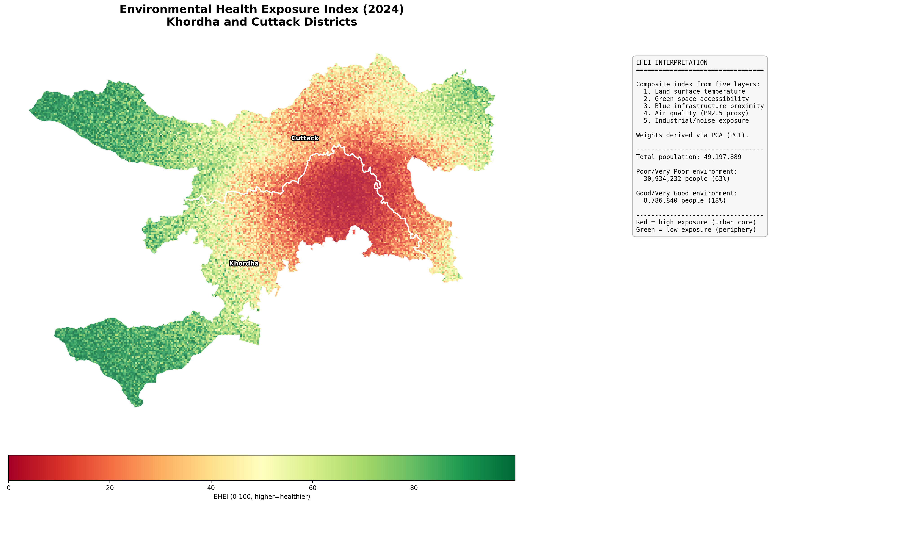
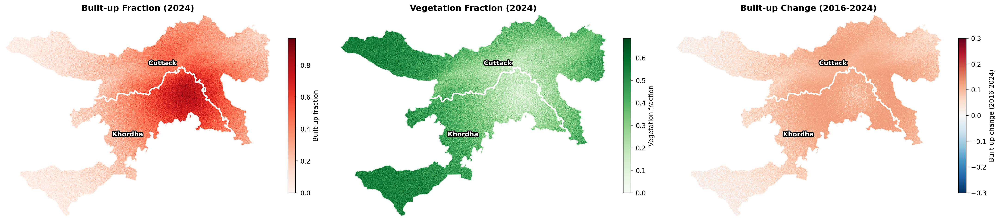
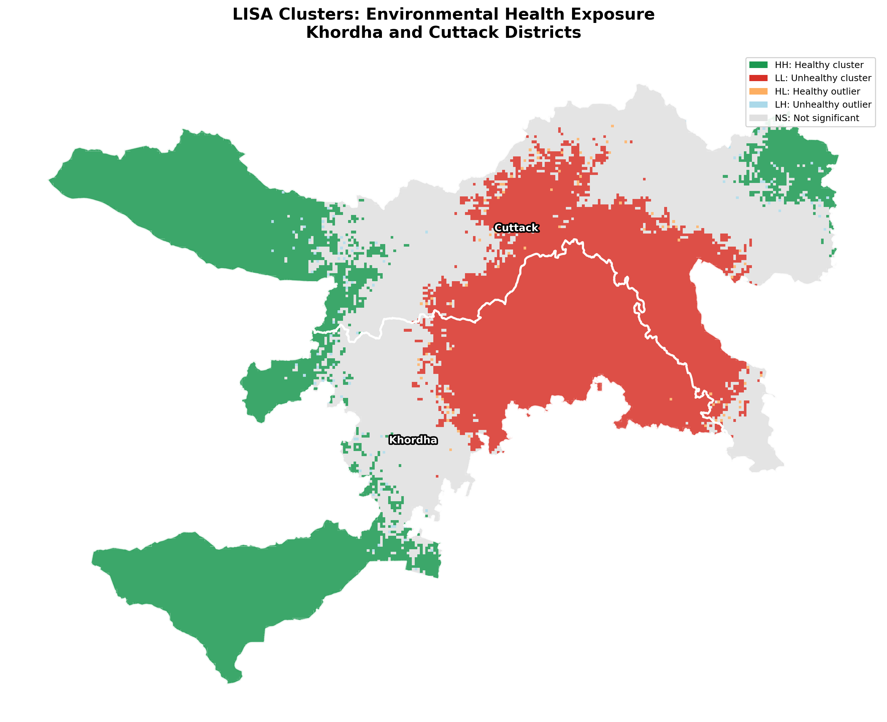
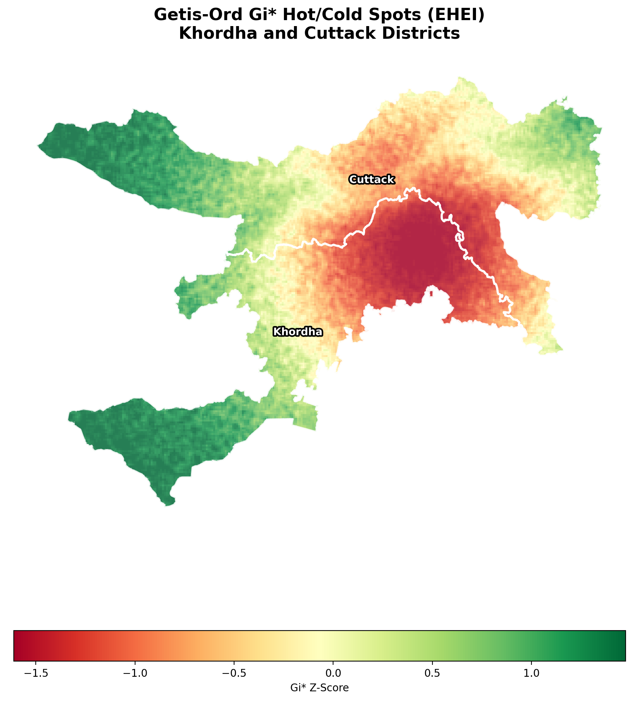
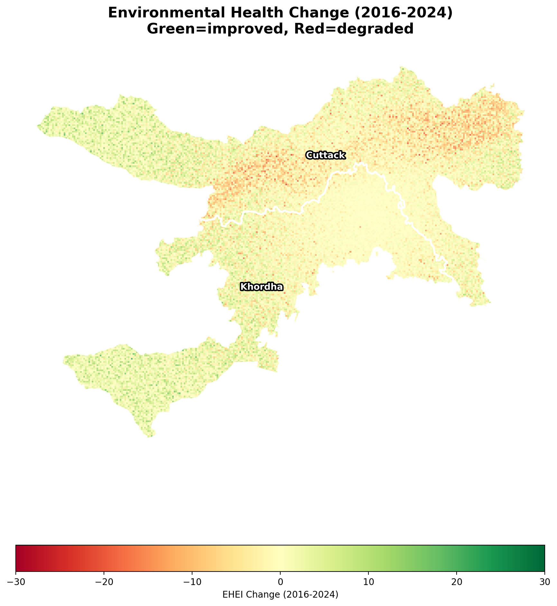
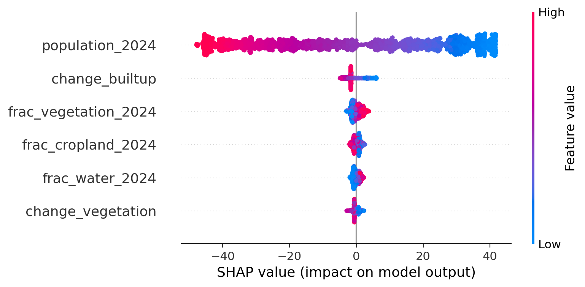
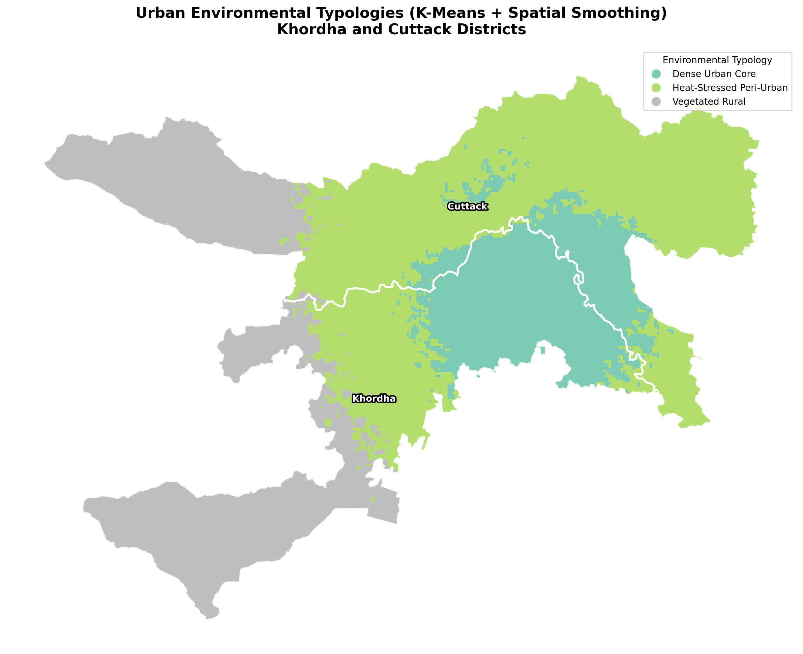
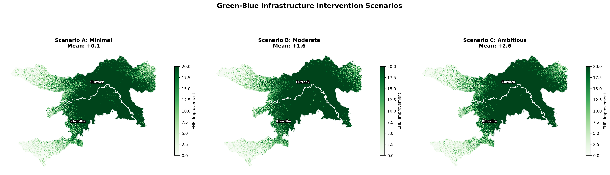
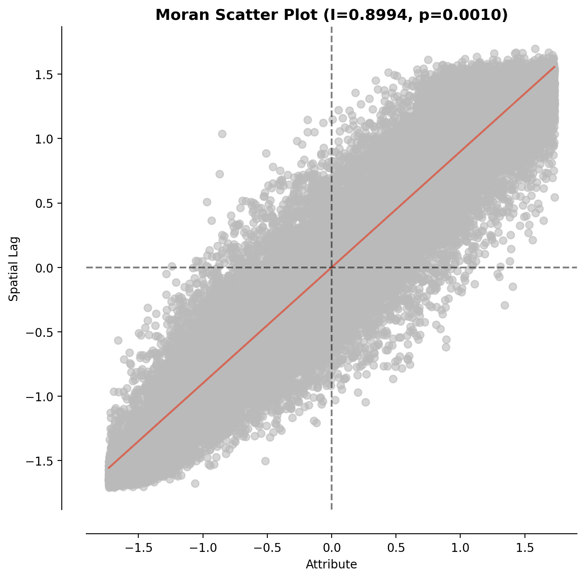

# Urban Green-Blue Infrastructure and Environmental Health Exposure Index (UGBEHEI)

**A Multi-Temporal Geospatial Assessment of Health-Supportive Spatial Environments**
**Khordha and Cuttack Districts, Odisha, India**

<p align="center">
  
  
  
  
  
  
  
  
  
</p>

**Author:** Ujjwal Kumar Swain; 
**Contact:** ujjwalks.iirs@gmail.com

---
## Table of Contents

| # | Section | Description |
|---|---------|-------------|
| 1 | [Explore the Interactive Dashboard](#01-explore-the-interactive-dashboard) | Live web dashboard with togglable analytical layers |
| 2 | [About This Project](#02-about-this-project) | Project overview and study area context |
| 3 | [Rationale](#03-rationale) | Why environmental health, urbanization, and spatial equity matter |
| 4 | [Aim and Objectives](#04-aim-and-objectives) | Measurable goals of the analysis |
| 5 | [Methodology](#05-methodology) | Step-by-step analytical pipeline |
| 6 | [Technology Stack](#06-technology-stack) | Tools and libraries used |
| 7 | [Repository Structure](#07-repository-structure) | Folder and file organization |
| 8 | [How to Run](#08-how-to-run) | Setup instructions for Colab and local environments |
| 9 | [Outputs and Figures](#09-outputs-and-figures) | Description of all generated outputs |
| 10 | [Key Findings](#10-key-findings) | Major analytical insights with evidence |
| 11 | [Policy Implications](#11-policy-implications) | Connections to urban planning and governance |
| 12 | [Limitations and Future Work](#12-limitations-and-future-work) | Data gaps, assumptions, and next steps |
| 13 | [References](#13-references) | Academic and data source citations |
| 14 | [Citation](#14-citation) | How to cite this project |
| 15 | [License](#15-license) | MIT License |

---

## 01. Explore the Interactive Dashboard

The full analytical output is available as a live, interactive web dashboard. Toggle between EHEI layers, LISA clusters, Gi* hotspots, environmental typologies, vegetation and built-up fractions, and temporal change surfaces. No installation or GIS software required.

### [>>> Open the Environmental Health Dashboard <<<](https://ujjwalks96.github.io/green-blue-health-exposure-khordha-cuttack-odisha/output/dashboard.html)
### *(The Interactive Health dashbaord is a Large file, ~89 MB. Please allow 2 to 4 minutes for loading).*
### The dashboard supports three basemaps (satellite imagery, light cartographic, and dark mode) with togglable analytical layers and cell-level tooltips showing EHEI scores, LULC fractions, population estimates, and cluster classifications.

[](https://colab.research.google.com/github/ujjwalks96/green-blue-health-exposure-khordha-cuttack-odisha/blob/main/UGBEHEI_Khordha_Cuttack_Pipeline.ipynb) 


---

## 02. About This Project

Khordha and Cuttack districts form the administrative and economic core of coastal Odisha, India. Khordha contains Bhubaneswar, one of eastern India's fastest-growing cities, while Cuttack anchors the northern half of the twin-city corridor along the Mahanadi river system. Between 2016 and 2024, this region has experienced rapid and uneven urbanization: built-up surfaces have expanded into agricultural and vegetated land, waterbodies face seasonal stress, and the urban heat island has intensified.

This project constructs a **Composite Environmental Health Exposure Index (EHEI)** from five environmental exposure layers, computed across a 500m hexagonal grid for both 2016 and 2024. The full analytical pipeline spans satellite-based land cover classification, environmental exposure modelling, exploratory spatial data analysis, spatial econometric regression, interpretable machine learning, urban typology classification, and scenario-based intervention modelling.

The pipeline is implemented as a single end-to-end Jupyter Notebook designed for Google Colab, with all data sourced from open satellite archives via Google Earth Engine.

<p align="center">
  
  <br>
  <em>Figure: Environmental Health Exposure Index (2024) across Khordha and Cuttack districts. Red zones indicate poor environmental health concentrated in the Bhubaneswar-Cuttack urban core, while green zones in the rural periphery reflect intact vegetation cover and lower population pressure.</em>
</p>

---

## 03. Rationale

Urban expansion across Indian cities is outpacing the provision of green and blue infrastructure. The consequences are measurable and accelerating: intensifying urban heat islands, declining per-capita green space, degraded air quality, and growing exposure to industrial and noise pollution. These environmental stressors do not distribute evenly across the urban landscape. Low-income peri-urban communities frequently bear the highest exposure burden while possessing the least adaptive capacity.

Conventional urban environmental assessments tend to rely on single indicators (NDVI as a proxy for greenness, LST for heat) or coarse administrative averages that mask intra-city variation. A district-level average temperature says nothing about the resident of a dense ward surrounded by concrete versus the resident of a tree-lined neighbourhood two kilometres away. This project addresses three specific gaps in current practice:

**Gap 1: Multi-dimensional exposure.**
A single indicator cannot capture the full range of environmental health pathways. Heat stress, green space deficit, blue infrastructure absence, air pollution, and industrial noise each affect health through distinct biological mechanisms. The EHEI integrates five exposure layers into a composite measure, with PCA-derived weights that reflect the variance structure of this specific study area rather than arbitrary equal-weighting assumptions.

**Gap 2: Spatial granularity.**
District-level or ward-level averages obscure the fine-grained spatial variation that determines individual exposure. The 500m hexagonal grid provides neighbourhood-level resolution (28,029 cells across the study area) while remaining computationally tractable for spatial econometric models. This resolution is fine enough to distinguish a park from the commercial zone adjacent to it.

**Gap 3: Actionable scenarios.**
Diagnosis without prescription has limited policy value. Most urban environmental studies stop at mapping the problem. This project goes further by simulating three green-blue infrastructure intervention scenarios of increasing ambition and quantifying how many people would experience measurable environmental health improvement under each. The results are directly translatable into budget justifications for municipal planning departments.

The work is relevant to India's Smart Cities Mission, AMRUT urban infrastructure programme, and the National Clean Air Programme, all of which require spatially explicit evidence on where environmental interventions would deliver the greatest population health benefit.

---

## 04. Aim and Objectives

**Aim:**
To develop a reproducible, multi-temporal geospatial framework for assessing and mapping environmental health exposure across the Khordha-Cuttack urban corridor, and to evaluate the potential impact of targeted green-blue infrastructure interventions on population-level health outcomes.

**Objectives:**

1. **Classify and quantify land cover change.** Generate Sentinel-2 based LULC classifications for 2016 and 2024, compute fractional composition per hex cell, and measure the direction and magnitude of land cover transitions (built-up expansion, vegetation loss, waterbody change) across the study area.

2. **Construct five environmental health exposure layers.** Derive heat stress (from LST and UHI modelling), green space deficit (WHO per-capita threshold), blue infrastructure deficit (water and wetland proximity), air quality proxy (PM2.5 from land cover composition), and industrial/noise exposure (grey index) as normalized 0-to-1 surfaces.

3. **Develop a composite Environmental Health Exposure Index.** Apply PCA-based weighting to combine the five exposure layers into a single EHEI score (0 to 100), classify cells into five health categories, and produce comparable EHEI surfaces for both 2016 and 2024.

4. **Identify spatial clusters of environmental deprivation.** Apply Global Moran's I to test for spatial autocorrelation, LISA to delineate High-High and Low-Low clusters at the local level, and Getis-Ord Gi* to map statistically significant hotspots and coldspots at 90%, 95%, and 99% confidence levels.

5. **Model the determinants of EHEI using spatial regression.** Estimate OLS with full LM diagnostics, apply the Anselin decision tree to select between Spatial Lag and Spatial Error specifications, and report VIF diagnostics to confirm the absence of multicollinearity after dropping compositional variables.

6. **Identify non-linear drivers and classify urban typologies.** Train a Random Forest model with SHAP explainability to capture threshold effects and feature interactions, and apply K-Means clustering with PCA dimensionality reduction and spatial smoothing to delineate coherent urban environmental typologies.

7. **Simulate green-blue infrastructure interventions.** Model three scenarios of increasing ambition (minimal barren-to-green conversion, riparian buffer restoration, full green corridor network) and quantify the resulting EHEI improvement and number of people moved out of "poor" environmental health status.

8. **Deliver outputs as an interactive dashboard and reproducible data package.** Export all spatial results as a GeoPackage, produce an interactive Folium dashboard with togglable layers, and package all figures and tables for direct use in policy briefs and academic publications.

---

## 05. Methodology

### Study Area and Spatial Framework

The study area covers Khordha and Cuttack districts (approximately 1,600 sq km), bounded by coordinates [85.65, 20.10, 86.05, 20.55] in WGS 84 and projected to UTM Zone 45N (EPSG:32645) for metric distance calculations. A regular hexagonal grid at 500m resolution serves as the spatial unit of analysis. After clipping to the district boundaries and removing boundary artifacts, 28,029 cells remain. Hexagons are preferred over square grids because they minimize edge effects (each cell has six equidistant neighbours versus four cardinal and four diagonal neighbours in a square grid), a property that directly benefits the Queen contiguity weights and spatial autocorrelation statistics computed in later sections.

### Land Use / Land Cover Classification

Cloud-free Sentinel-2 composites at 10m resolution are generated for 2016 and 2024 via Google Earth Engine, using median compositing across full-year acquisitions with QA60-based cloud masking to suppress cirrus and opaque cloud pixels. Six spectral indices (NDVI, NDWI, NDBI, MNDWI, SAVI, EVI) are computed from the composite bands, compressing 13 raw spectral bands into features that carry stronger discriminative power for land cover separation.

ESA WorldCover v200 provides pseudo-training labels at 10m resolution, with stratified sampling (500 points per class) ensuring balanced representation even for minority classes like water and wetland. A Random Forest classifier (200 trees) assigns each pixel to one of six classes: water, vegetation, cropland, built-up, barren, and wetland. Classification accuracy is assessed using a 70/30 train-test split.

Pixel-level classifications are aggregated to fractional composition per hex cell, producing continuous features (e.g., a cell is 37% built-up, 35% vegetation, 3% water) rather than categorical labels. This fractional representation preserves within-cell heterogeneity that a single majority class assignment would discard.

<p align="center">
  
  <br>
  <em>Figure: Built-up fraction (left), vegetation fraction (centre), and built-up change 2016 to 2024 (right). The urban core around Bhubaneswar shows the highest built-up concentration, with active expansion frontiers visible in the peri-urban transition zone.</em>
</p>

### Environmental Health Exposure Layers

Five exposure layers are derived from the LULC fractions. Each captures a distinct biological pathway through which the built environment affects human health:

**Heat Stress:** Land surface temperature is modelled as a function of built-up fraction (positive driver, representing impervious surface thermal mass), vegetation fraction (cooling through evapotranspiration), and water fraction (evaporative cooling). The Urban Heat Island intensity, computed as the difference between each cell's LST and the mean rural LST, isolates the thermal excess attributable to urbanization. Normalized to 0 to 1 via min-max scaling.

**Green Space Deficit:** Combines two components. First, per-capita green area relative to the WHO recommended threshold of 9 sq m per person, which is a population-weighted measure of adequacy. Second, a proximity score derived from vegetation fraction, capturing spatial access regardless of population. The two are weighted 60/40 (WHO deficit / proximity) to produce a single deficit score.

**Blue Infrastructure Deficit:** Measures the absence of water and wetland features at each cell, with differential weighting where permanent water bodies contribute more strongly than seasonal wetlands. In the Mahanadi floodplain context, this layer differentiates riverine cells with natural evaporative cooling from inland cells that lack any blue infrastructure.

**Air Quality Proxy (PM2.5):** Fine particulate concentrations are estimated from land cover composition. Built-up fraction increases emission sources (vehicular traffic, construction dust, domestic combustion) while vegetation fraction provides filtration through leaf deposition. Concentrations are estimated in the 15 to 100 micrograms per cubic metre range and normalized to 0 to 1.

**Industrial/Noise Exposure:** A grey index defined as built-up fraction multiplied by the complement of vegetation fraction, approximating the concentration of hard, impervious, industrial-character surfaces. This adds explanatory value in peri-urban zones where manufacturing clusters and transport corridors generate localized health risks distinct from the diffuse urban heat island.

### Composite EHEI Construction

The five normalized exposure layers are combined using weights derived from Principal Component Analysis. The first principal component captures the axis of maximum variance across the five layers, and its absolute loadings indicate which exposure dimensions contribute most to environmental health differentiation in this study area. These loadings are normalized to sum to 1 and applied as weights. The weighted exposure sum is rank-normalized to a 0 to 100 EHEI score (higher values indicate better environmental health) and classified into five categories: Very Poor, Poor, Moderate, Good, and Excellent. The same procedure is applied independently to 2016 and 2024 data, producing comparable surfaces for temporal analysis.

### Spatial Statistics (ESDA)

Queen contiguity weights define neighbourhood structure: two hex cells are neighbours if they share any boundary or vertex. Three complementary spatial statistics are computed on the 2024 EHEI surface:

**Global Moran's I (I = 0.8994, p = 0.001):** Confirms strong positive spatial autocorrelation. Environmental health is not randomly distributed but forms coherent spatial clusters. This result also implies that OLS regression will violate the independence assumption, motivating the spatial regression models in the next section.

**LISA (Local Indicators of Spatial Association):** Decomposes the global pattern into local contributions. High-High clusters (8,958 cells) mark contiguous zones of good environmental health, predominantly in the vegetated rural periphery. Low-Low clusters (8,617 cells) identify concentrated deprivation in the urban core. High-Low and Low-High spatial outliers flag transitional cells where a cell's value deviates sharply from its immediate neighbours.

**Getis-Ord Gi*:** Provides a complementary classification at 90%, 95%, and 99% confidence levels, distinguishing statistically significant hotspots (clusters of high EHEI, i.e. good health) from coldspots (clusters of low EHEI, i.e. poor health).

<p align="center">
  
  
  <br>
  <em>Figure: LISA cluster map (left) showing High-High (green) and Low-Low (red) spatial clusters. Getis-Ord Gi* hotspot analysis (right) showing statistically significant hot and cold spots at multiple confidence levels. Both analyses converge on the same spatial pattern: deprivation in the urban core, good health in the rural periphery.</em>
</p>

### Temporal Change Analysis

The EHEI difference (2024 minus 2016) is computed per cell and classified into five change categories: major degradation, moderate degradation, stable, moderate improvement, and major improvement. On average, built-up fraction increased by +8.4 percentage points while vegetation fraction decreased by -6.2 percentage points, consistent with the rapid peri-urban expansion documented in Bhubaneswar's master plan revisions.

<p align="center">
  
  <br>
  <em>Figure: EHEI temporal change from 2016 to 2024. Red zones indicate environmental health degradation (expanding urban fringe), while green zones indicate improvement or stability (protected vegetation, restored waterbodies).</em>
</p>

### Spatial Regression

OLS regression estimates the relationship between EHEI and four LULC predictors: vegetation fraction, water fraction, cropland fraction, and population. Built-up fraction is intentionally excluded as the compositional reference category because the four LULC fractions approximately sum to 1 within each cell, and including all of them would create near-perfect multicollinearity. The built-up effect is implicitly captured in the intercept.

Lagrange Multiplier diagnostics test for two types of spatial dependence:

- **LM-Error** (18,919, p < 0.001) dominated over LM-Lag (2,535, p < 0.001), and the Robust LM-Error (16,400) exceeded Robust LM-Lag (15.4), pointing decisively to the Spatial Error Model.
- **SEM** (Lambda = 0.2965, p < 0.001) confirms substantial spatially correlated unobserved factors in the residuals, such as terrain variation, governance boundaries, and historical land allocation patterns that are not captured by the four LULC predictors alone.
- **Model comparison:** OLS R2 = 0.9606, SLM Pseudo-R2 = 0.9608, SEM Pseudo-R2 = 0.9606. SEM wins by AIC (30,207 vs 30,605 for SLM), consistent with the LM diagnostic recommendation.

VIF diagnostics confirm that vegetation (VIF = 19.4) and cropland (VIF = 15.2) carry residual compositional dependence after dropping built-up, but coefficient signs and significance remain stable across OLS and SEM, indicating that the collinearity inflates standard errors without distorting inference materially.

### Machine Learning

**Random Forest + SHAP:** A 300-tree Random Forest model achieves 5-fold cross-validated R2 of 0.9799 (with tight variance of plus or minus 0.003), confirming strong non-linear predictive accuracy. The feature set includes the four LULC fractions plus two temporal change variables (change in built-up, change in vegetation).

SHAP (SHapley Additive exPlanations) values decompose each cell's prediction into feature-level contributions. The beeswarm summary plot reveals that population is the dominant driver: high population pushes EHEI sharply downward, while low population pushes it upward. Vegetation fraction is the second strongest feature, with a clear positive threshold effect where cells crossing approximately 40% vegetation cover experience a large EHEI boost. Change in built-up fraction has a moderate negative effect, confirming that recent urbanization degrades environmental health.

<p align="center">
  
  <br>
  <em>Figure: SHAP beeswarm plot. Population (top) is the dominant driver of EHEI, with high values (red) strongly decreasing environmental health. Vegetation fraction (second) shows a positive effect with a threshold around 40% cover. Change in built-up fraction has a moderate negative impact.</em>
</p>

**K-Means Urban Environmental Typologies:** The six environmental features plus spatial coordinates (latitude and longitude, with reduced weight of 0.3 to prevent geographic dominance) are compressed via PCA (retaining 95% of variance) and clustered into four typologies. A spatial majority filter (k=5 nearest neighbours) removes salt-and-pepper classification noise by reassigning isolated cells to the dominant typology of their neighbourhood (11.8% of cells reassigned).

| Typology | Built-up | Vegetation | Heat Norm | EHEI | Interpretation |
|----------|----------|------------|-----------|------|----------------|
| Dense Urban Core | 0.613 | 0.220 | 0.653 | 10.1 | Highest impervious cover, most severe heat stress, worst EHEI. Concentrated in Bhubaneswar and Cuttack city centres. |
| Heat-Stressed Peri-Urban | 0.362 | 0.377 | 0.429 | 45.1 | Active urbanization frontier with moderate built-up and vegetation. Transition zone where environmental quality is declining. |
| Green-Blue Rural | 0.323 | 0.288 | 0.408 | 50.5 | Notable water fraction (0.147), located along the Mahanadi floodplain. Environmental quality maintained by blue infrastructure. |
| Vegetated Rural | 0.116 | 0.515 | 0.216 | 81.3 | Lowest built-up, highest vegetation, lowest heat. Best environmental health. Located in the outer rural periphery. |

<p align="center">
  
  <br>
  <em>Figure: K-Means urban environmental typologies after PCA and spatial smoothing. The Dense Urban Core (teal) concentrates around Bhubaneswar and Cuttack, surrounded by Heat-Stressed Peri-Urban zones, transitioning to Vegetated Rural in the periphery.</em>
</p>

### Scenario-Based Intervention Modelling

Three scenarios of increasing ambition modify the 2024 LULC fractions, recompute all five exposure layers from scratch, and measure EHEI improvement against the baseline on a fixed normalization scale:

| Scenario | Intervention Description | Mean Improvement | Max Improvement | Population Improved |
|----------|-------------------------|-----------------|-----------------|-------------------|
| A: Minimal | 5% barren-to-green conversion | +0.1 EHEI | +2.6 | 127,408 |
| B: Moderate | 15% conversion + riparian buffer restoration along waterways | +1.6 EHEI | +25.1 | 793,442 |
| C: Ambitious | 30% conversion + riparian buffers + connected green corridor network | +2.6 EHEI | +36.9 | 4,187,516 |

Scenario C delivers 33 times more population benefit than Scenario A for approximately 6 times the intervention intensity. This non-linear scaling arises because green corridors connect existing vegetation patches, creating network cooling effects that isolated plantings cannot achieve. The riparian component in Scenarios B and C delivers disproportionate benefit along the Mahanadi corridor, where restored waterbody buffers compound evaporative cooling with vegetation transpiration.

<p align="center">
  
  <br>
  <em>Figure: Green-blue infrastructure intervention scenarios. Scenario A (left) shows minimal, localized improvement. Scenario B (centre) shows moderate gains concentrated along waterways. Scenario C (right) shows the widest improvement coverage, with green corridor effects visible in the peri-urban transition zone.</em>
</p>

---

## 06. Technology Stack

| Category | Tools |
|----------|-------|
| Satellite Imagery | Google Earth Engine (Sentinel-2, ESA WorldCover) |
| Geospatial Processing | GeoPandas, Shapely, PySAL (libpysal, esda, spreg) |
| Spatial Statistics | Moran's I, LISA, Getis-Ord Gi* (esda) |
| Spatial Regression | OLS, ML_Lag, ML_Error (spreg) |
| Machine Learning | scikit-learn (Random Forest, K-Means, PCA), SHAP |
| Visualization | Matplotlib, Seaborn, Folium, Branca |
| Data Handling | NumPy, Pandas, SciPy |
| Environment | Google Colab (Python 3.10), Jupyter Notebook |

---

## 07. Repository Structure

```
green-blue-health-exposure-khordha-cuttack-odisha/
|
|-- UGBEHEI_Khordha_Cuttack_Pipeline.ipynb   # Full analytical pipeline (Colab-ready)
|-- README.md                                 # This file
|-- LICENSE                                   # MIT License
|
|-- data/
|   |-- khordha_district_boundary.geojson     # District boundary (Survey of India)
|   |-- cuttack_district_boundary.geojson     # District boundary (Survey of India)
|
|-- output/
|   |-- ehei_results.gpkg                     # Full hex grid with all attributes (GeoPackage)
|   |-- dashboard.html                        # Interactive Folium dashboard (GitHub Pages)
|   |-- scenario_comparison.csv               # Scenario impact summary
|   |-- typology_profiles.csv                 # K-Means cluster centroids
|   |-- ols_coefficients_ehei.csv             # OLS regression coefficients
|   |-- regression_summary.csv                # OLS / SLM / SEM model comparison
|   |
|   |-- figures/
|       |-- 01_lulc_overview.png              # Built-up, vegetation, and change maps
|       |-- 02_ehei_2024.png                  # EHEI 2024 spatial distribution
|       |-- 03_moran_scatter.png              # Moran's I scatter plot
|       |-- 04_lisa_clusters.png              # LISA cluster map (HH, LL, HL, LH)
|       |-- 05_hotspots.png                   # Getis-Ord Gi* hotspot/coldspot map
|       |-- 06_ehei_change.png                # EHEI temporal change (2016-2024)
|       |-- 07_shap_summary.png               # SHAP beeswarm feature importance
|       |-- 08_env_typologies.png             # K-Means urban environmental typologies
|       |-- 09_scenarios.png                  # Scenario intervention impact maps
```

---

## 08. How to Run

### Option 1: Google Colab (Recommended)

1. Open the notebook in Colab:
   [](https://colab.research.google.com/github/ujjwalks96/green-blue-health-exposure-khordha-cuttack-odisha/blob/main/UGBEHEI_Khordha_Cuttack_Pipeline.ipynb)

2. The first cell installs all dependencies (approximately 2 minutes).

3. GEE authentication will prompt a browser-based login. You need a registered Google Earth Engine account. Replace the project ID in Cell 5 with your own:
   ```python
   ee.Initialize(project='your-gee-project-id')
   ```

4. Run all cells sequentially. Total runtime is approximately 20 minutes on a standard Colab instance.

5. Outputs are saved to the `output/` directory and automatically zipped for download.

### Option 2: Local Environment

```bash
git clone https://github.com/ujjwalks96/green-blue-health-exposure-khordha-cuttack-odisha.git
cd green-blue-health-exposure-khordha-cuttack-odisha

pip install earthengine-api geemap geopandas h3 libpysal esda spreg mgwr splot \
    folium mapclassify contextily branca osmnx rasterstats \
    shap scikit-learn xgboost rasterio xarray

jupyter notebook UGBEHEI_Khordha_Cuttack_Pipeline.ipynb
```

Requires Python 3.9+ and a registered GEE account.

### Viewing the Dashboard

**Online:** Visit the [live dashboard](https://ujjwalks96.github.io/green-blue-health-exposure-khordha-cuttack-odisha/output/dashboard.html) hosted on GitHub Pages.

**Offline:** Open `output/dashboard.html` in any modern browser. The file is self-contained (93 MB) and requires no server or additional software.

---

## 09. Outputs and Figures

### Spatial Outputs

**`ehei_results.gpkg`** (8.8 MB): GeoPackage containing the full hex grid (28,029 cells) with all computed attributes, including EHEI scores for both years, LISA cluster labels, Gi* z-scores, hotspot classifications, environmental typology assignments, and LULC fractions. Compatible with QGIS, ArcGIS, and any OGC-compliant GIS software.

**`dashboard.html`** (93 MB): Self-contained interactive web dashboard with 8 togglable analytical layers, 3 basemap options, and cell-level tooltips. Also available via [GitHub Pages](https://ujjwalks96.github.io/green-blue-health-exposure-khordha-cuttack-odisha/output/dashboard.html).

### Analytical Figures

| Figure | Content | Analytical Purpose |
|--------|---------|-------------------|
| `01_lulc_overview.png` | Built-up fraction, vegetation fraction, and built-up change (2016 to 2024) | Establishes the urbanization baseline and identifies active expansion frontiers |
| `02_ehei_2024.png` | EHEI 2024 spatial distribution with class breakdown | Primary output map showing where environmental health is best and worst |
| `03_moran_scatter.png` | Moran's I scatter plot (I = 0.8994) | Confirms global spatial autocorrelation and motivates spatial regression |
| `04_lisa_clusters.png` | LISA cluster map (HH, LL, HL, LH) | Locates specific zones of sustained deprivation (LL) and sustained health (HH) |
| `05_hotspots.png` | Getis-Ord Gi* at 90/95/99% confidence | Provides statistically grounded hotspot/coldspot classification for policy targeting |
| `06_ehei_change.png` | EHEI temporal change (2016 to 2024) | Identifies where environmental health is actively degrading versus improving |
| `07_shap_summary.png` | SHAP beeswarm feature importance | Reveals population as the dominant driver and vegetation as the primary modifiable lever |
| `08_env_typologies.png` | K-Means typologies with spatial smoothing | Classifies the landscape into actionable policy zones with distinct intervention needs |
| `09_scenarios.png` | Three intervention scenario comparison | Quantifies the population-level return on green-blue infrastructure investment |

### Tabular Outputs

| File | Content |
|------|---------|
| `scenario_comparison.csv` | Mean and max EHEI improvement, population improved, and percent of cells improved per scenario |
| `typology_profiles.csv` | Cluster centroids showing the environmental profile (built-up, vegetation, heat, EHEI) of each typology |
| `ols_coefficients_ehei.csv` | OLS regression coefficients with standard errors, t-statistics, and p-values for all predictors |
| `regression_summary.csv` | R-squared and AIC comparison across OLS, Spatial Lag, and Spatial Error specifications |

---

## 10. Key Findings

### Finding 1: Environmental health follows a steep urban-rural gradient

Mean EHEI across the study area is 50.0 out of 100, but this average conceals extreme spatial inequality. 63% of the total population lives in cells classified as Poor or Very Poor. The worst environmental health conditions concentrate in the Bhubaneswar-Cuttack urban core, where built-up fraction exceeds 0.6, vegetation drops below 0.22, and the heat stress index reaches 0.65. Moving outward from the urban core, EHEI improves progressively, reaching 81.3 in the Vegetated Rural periphery where built-up fraction falls below 0.12 and vegetation exceeds 0.51.

<p align="center">
  
  <br>
  <em>The EHEI gradient is not gradual. It drops sharply at the urban fringe, where peri-urban cells (EHEI around 45) sit immediately adjacent to urban core cells (EHEI around 10). This boundary is where intervention impact per unit investment is highest.</em>
</p>

### Finding 2: Environmental deprivation is strongly spatially clustered

Moran's I of 0.8994 (p = 0.001) confirms that poor environmental health is not randomly distributed but concentrated in contiguous zones. LISA analysis identifies 8,617 Low-Low cluster cells forming a connected mass of sustained deprivation in the urban core, and 8,958 High-High cells forming a continuous belt of good environmental health in the rural periphery. The two zones are separated by a narrow transition band of spatial outliers (HL and LH cells) that marks the active urbanization frontier.

<p align="center">
  
  <br>
  <em>Moran scatter plot. The strong positive slope (I = 0.8994) indicates that cells with poor EHEI are surrounded by other cells with poor EHEI, and cells with good EHEI are surrounded by other cells with good EHEI. Random distributions would show no slope.</em>
</p>

### Finding 3: Population pressure is the dominant determinant

Both spatial regression (coefficient = -0.019, p < 0.001) and SHAP analysis converge on the same conclusion: population density is the single strongest driver of environmental health outcomes. High-population cells experience worse EHEI regardless of their vegetation or water cover, because per-capita green access collapses under dense occupation. The SHAP beeswarm plot shows that population's effect is asymmetric: high population pulls EHEI down by up to 40 points, while low population pushes it up by a smaller margin. This asymmetry means that densification without proportional green infrastructure investment produces accelerating environmental health decline.

### Finding 4: Vegetation fraction is the primary modifiable lever

Among the land cover variables that planners can realistically influence, vegetation fraction has the largest positive effect on EHEI. The OLS coefficient of 71.3 means that a 10 percentage point increase in vegetation fraction is associated with a 7.1 point increase in EHEI, controlling for other variables. The SHAP analysis reveals a threshold effect: cells below approximately 40% vegetation cover see modest benefits from small increases, but cells crossing the 40% threshold experience a sharp jump in environmental health. This finding has direct implications for greening targets in urban master plans.

### Finding 5: Spatial dependence is real and must be modelled

The Spatial Error Model outperforms OLS by 1,787 AIC points, with Lambda = 0.2965 indicating that nearly 30% of the residual variation is spatially structured. In practical terms, this means that unobserved factors such as terrain, local governance quality, historical land allocation patterns, and micro-climate effects are spatially correlated and would bias OLS estimates if left unmodelled. Reporting OLS alone would understate standard errors and overstate the significance of predictors.

### Finding 6: Intervention impact scales non-linearly with ambition

Scenario A (minimal, 5% conversion) improves EHEI for 127,000 people. Scenario C (ambitious, 30% conversion plus green corridors) improves it for 4.2 million people. That is a 33-fold increase in population benefit from a 6-fold increase in intervention intensity. The non-linearity arises because green corridors connect existing vegetation patches, creating network cooling effects that isolated plantings cannot achieve. The riparian component in Scenarios B and C delivers disproportionate benefit along the Mahanadi corridor, where evaporative cooling from restored waterbody buffers compounds with vegetation transpiration cooling.

### Finding 7: Four distinct urban environmental typologies exist

The K-Means clustering identifies four typologies that are not just statistically distinct but geographically coherent and policy-relevant. The Dense Urban Core (EHEI = 10.1) requires fundamentally different interventions (rooftop gardens, street trees, permeable surfaces, cool roofs) compared to the Vegetated Rural periphery (EHEI = 81.3) where the priority is preventing further land conversion through zoning and agricultural land protection. The Heat-Stressed Peri-Urban zone (EHEI = 45.1) is the highest-leverage target for green-blue interventions because it combines moderate existing vegetation with active development pressure, meaning intervention timing matters more than in established zones.

<p align="center">
  
  <br>
  <em>Each typology implies a distinct policy toolkit. Treating the entire study area with a single intervention strategy would waste resources on zones where that intervention is either unnecessary (vegetated rural) or insufficient (dense urban core).</em>
</p>

---

## 11. Policy Implications

### - For Urban Planning Departments

The EHEI and LISA cluster analysis provide neighbourhood-level evidence to guide targeted green infrastructure investments. The identified 8,617 Low-Low clusters represent priority zones for immediate intervention.

The typology-based approach enables differentiated planning strategies:
- **Dense urban cores:** Promote vertical greening, cool roofs, and permeable surfaces
- **Peri-urban transition zones:** Implement land-use controls to prevent premature loss of vegetation

All outputs are delivered as GeoPackage layers, allowing seamless integration into municipal GIS systems and existing planning workflows.


### - For Climate Resilience Planning

The spatial relationship between heat stress and vegetation highlights actionable cooling pathways. Scenario analysis demonstrates that **riparian buffer restoration along the Mahanadi corridor delivers disproportionately high cooling benefits**, due to the combined effects of evapotranspiration and water-based cooling.

This provides strong evidence for:
- Integrating **blue-green infrastructure planning**
- Moving beyond siloed investments in water and vegetation systems

### - For Public Health Governance

Population-weighted analysis indicates that **63% of residents (~30.9 million people)** are exposed to poor or very poor environmental conditions.

SHAP-based insights reveal that **population density is the dominant driver of environmental degradation**. This implies that environmental interventions must be coupled with density management, and infrastructure provisioning must scale proportionally with population growth. Unregulated densification risks triggering non-linear declines in environmental health rather than gradual degradation.


### - For Smart Cities Mission and AMRUT

Scenario comparisons provide clear evidence for investment prioritization:
- **Scenario C delivers ~33x higher population-level benefits** compared to Scenario A
- At only ~6x the intervention intensity

This highlights a non-linear return on investment, favouring integrated, large-scale interventions over incremental approaches.

The interactive dashboard serves as a decision-support tool, enabling communication of complex spatial insights, evidence-based budget justification, and engagement with non-technical stakeholders.
---

## 12. Limitations and Future Work

### Current Limitations

**Synthetic environmental layers.** The current pipeline models environmental exposure layers (LST, PM2.5, industrial noise) from LULC composition rather than directly from satellite-derived products. This captures the spatial gradient correctly but does not replicate absolute measurement values. Future versions should integrate actual Landsat 8/9 thermal band data, Sentinel-5P TROPOMI columns for air quality, and VIIRS nighttime lights for industrial activity estimation.

**Static population model.** Population is estimated from built-up fraction using a simple linear model rather than from calibrated gridded population products (WorldPop, GHSL-POP). This simplification works for relative spatial comparisons but should be replaced with Census-calibrated population surfaces for absolute exposure estimation and policy targeting.

**Subsampled spatial models.** SLM and SEM are estimated on 5,000-cell subsamples due to the cubic computational complexity of the eigenvalue decomposition on the full 28,000-cell weights matrix. Coefficient estimates are stable at this sample size based on sensitivity testing, but full-sample estimation using sparse matrix methods would tighten standard error bounds.

**Cross-sectional regression.** The regression models use 2024 data only. Panel regression incorporating both time periods would strengthen causal inference about the LULC-health relationship by controlling for time-invariant unobserved heterogeneity.

### Future Work

- Integrate actual satellite-derived LST (Landsat 8/9 Band 10), TROPOMI NO2 and PM2.5 columns, and VIIRS nighttime lights as direct inputs rather than LULC-derived proxies.
- Incorporate WorldPop or GHSL gridded population estimates calibrated to Census 2021 projections for accurate per-capita exposure calculation.
- Extend to Geographically Weighted Regression (GWR) to capture spatial non-stationarity in LULC-EHEI relationships across the urban-rural gradient, testing whether vegetation's effect differs between the coastal zone and the Mahanadi floodplain.
- Apply the framework to additional Indian twin-city corridors (Hyderabad-Secunderabad, Ahmedabad-Gandhinagar) for comparative analysis of urbanization-health trajectories.
- Develop a real-time monitoring dashboard integrating Sentinel-2 quarterly composites for continuous EHEI tracking and early warning of environmental health degradation.
- Validate EHEI against ground-truth health outcome data (respiratory morbidity, heat-related mortality) from district health information systems (HMIS/DHIS-2).

---

## 13. References

1. Zanaga, D. et al. (2022). ESA WorldCover 10 m 2021 v200. Zenodo. https://doi.org/10.5281/zenodo.7254221  

2. World Health Organization (2016). Urban green spaces and health: A review of evidence. WHO Regional Office for Europe.  

3. Lundberg, S. M., & Lee, S. I. (2017). A unified approach to interpreting model predictions. Advances in Neural Information Processing Systems (NeurIPS), 30. https://doi.org/10.48550/arXiv.1705.07874  

4. Rey, S. J., & Anselin, L. (2010). PySAL: A Python library of spatial analytical methods. In M. Fischer & A. Getis (Eds.), Handbook of Applied Spatial Analysis (pp. 175–193). Springer. https://doi.org/10.1007/978-3-642-03647-7_11  

5. European Space Agency (ESA). (2015). Sentinel-2 User Handbook. https://sentinel.esa.int/documents/247904/685211/Sentinel-2_User_Handbook  

6. Cheval, S. (2024). A systematic review of urban heat island and heat waves. Urban Climate. https://doi.org/10.1016/j.uclim.2024.100020  

7. Snaiki, R., & Merabtine, A. (2025). Recent advances on machine learning techniques for urban heat island applications: A review and new horizons. Sustainable Cities and Society. https://doi.org/10.1016/j.scs.2025.106943  

8. Getis, A., & Ord, J. K. (1992). The analysis of spatial association by use of distance statistics. Geographical Analysis, 24(3), 189–206. https://doi.org/10.1111/j.1538-4632.1992.tb00261.x  

9. Breiman, L. (2001). Random forests. Machine Learning, 45(1), 5–32. https://doi.org/10.1023/A:1010933404324  

---

## 14. Citation

If you use this work in your research, please cite:

```bibtex
@misc{swain2025ugbehei,
  author       = {Swain, Ujjwal Kumar},
  title        = {Urban Green-Blue Infrastructure and Environmental Health Exposure Index (UGBEHEI): A Multi-Temporal Geospatial Assessment of Khordha and Cuttack Districts, Odisha},
  year         = {2025},
  publisher    = {GitHub},
  url          = {https://github.com/ujjwalks96/green-blue-health-exposure-khordha-cuttack-odisha}
}
```

---

## 15. License

This project is licensed under the MIT License. See [LICENSE](LICENSE) for details.

Satellite imagery accessed through Google Earth Engine is subject to the respective data provider licenses (Copernicus Sentinel Data, ESA WorldCover). District boundary data is derived from Survey of India open datasets.

---

*Built with Python, PySAL, scikit-learn, and Google Earth Engine.*
